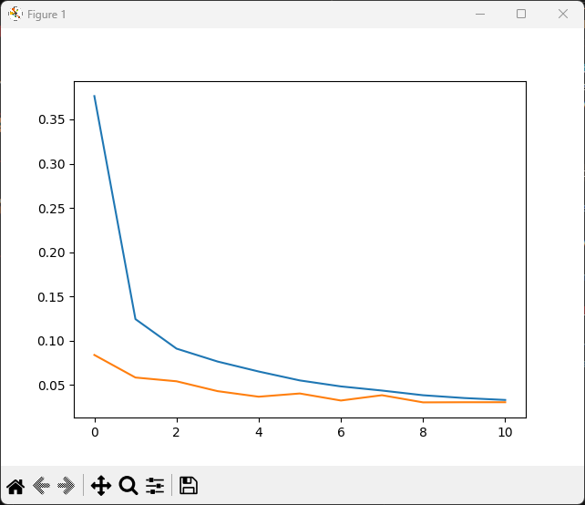
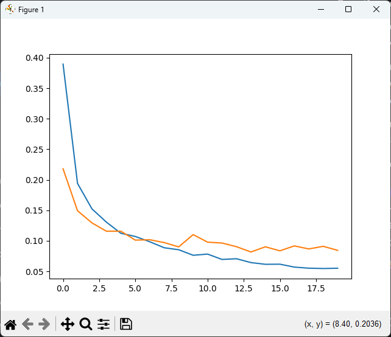

# Task 1 — MNIST Classification System

The digit classification system is engineered using a modular, object-oriented framework designed for high-performance inference and comparative benchmarking.

---

## 1. Architectural Design: The Strategy Pattern

- **Abstract Interface:** A base `MnistClassifierInterface` defines the polymorphic contract for `train`, `predict`, `save`, and `load` operations.
- **Unified Wrapper:** The `MnistClassifier` class serves as a high-level dispatcher that instantiates the requested algorithm (`CNN`, `FFNN`, or `RF`) at runtime.
- **Modularity:** This design allows for seamless integration of additional models without modifying existing pipeline code.

---

## 2. Model Architectures 

### A. Convolutional Neural Network (CNN)

Designed to capture spatial hierarchies and local patterns within the 28×28 pixel grid:

| Parameter | Value |
|-----------|-------|
| Feature Extraction | Two-layer convolutional backbone (32 and 64 filters), 3×3 kernels, ReLU |
| Regularization | `Dropout(0.5)` before the softmax layer |
| Optimizer | `Adam` with LR=0.0005 and L2 weight decay (1e-4) |

### B. Feed-Forward Neural Network (FFNN)

A deep MLP architecture serving as a baseline for non-spatial feature processing:

| Parameter | Value |
|-----------|-------|
| Topology | 784 → 256 → 128 → 10, ReLU activation |
| Regularization | `Dropout(0.2)` on flattened feature vector |

### C. Random Forest (RF)

An ensemble learning approach representing classical machine learning:

| Parameter | Value |
|-----------|-------|
| Estimators | 100 decision trees (`n_estimators=100`) |
| Processing | Parallel (`n_jobs=-1`) |
| Persistence | `joblib` compression level 3 |

---

## 3. Data Preprocessing and Augmentation

The `utils/data_loader.py` module facilitates consistent data preparation across all models:

- **Normalization:** Pixel values are scaled to `[0, 1]` and subsequently normalized to `[-1, 1]` for neural network compatibility.
- **Augmentation Strategy:** To enhance robustness against handwriting variations in the real-time demo, the pipeline supports `RandomRotation` (±15°) and `RandomAffine` transformations. Applying image augmentation for Random Forest is inefficient because RF operates on raw flattened pixel vectors and lacks the spatial inductive bias needed to benefit from transformed inputs — unlike CNNs, it cannot learn translation or rotation invariance, so augmented samples add noise rather than useful signal.

---

## 4. Model Evaluation and Testing

The evaluation framework consists of quantitative metrics and real-world qualitative testing:

### Quantitative Validation

- During neural model training, a **10% validation split** is isolated via `train_test_split`.
- Convergence is monitored via per-epoch tracking of `train_loss` and `val_loss`.
- For the Random Forest model, final performance is verified by calculating mean accuracy on a dedicated test set.

### Epoch Selection & Overfitting Analysis
 
Both neural models were initially trained for **30 epochs**, with `train_loss` and `val_loss` curves inspected visually to determine the optimal stopping point.
 
| Model | Selected Epochs | Observation |
|-------|----------------|-------------|
| CNN | 11 | Val loss begins diverging from train loss after epoch 11 |
| FFNN | 20 | Val loss stabilizes and slightly increases beyond epoch 20 |
 
For the **CNN**, the loss curves converge sharply within the first 2 epochs and remain tightly coupled until epoch ~11, after which the growing gap between `train_loss` and `val_loss` indicates the onset of overfitting. The **FFNN** exhibits a similar but more gradual divergence, tolerating a larger number of epochs before the validation signal degrades, likely due to its lower model capacity and weaker `Dropout(0.2)` regularization compared to the CNN's `Dropout(0.5)`.
 
The relatively low epoch counts required for both models can be attributed to the nature of the dataset itself: despite the applied augmentation, MNIST remains a structurally simple benchmark with low class variance. The models saturate the learnable signal early, leaving subsequent epochs to overfit noise rather than generalize further.
 

